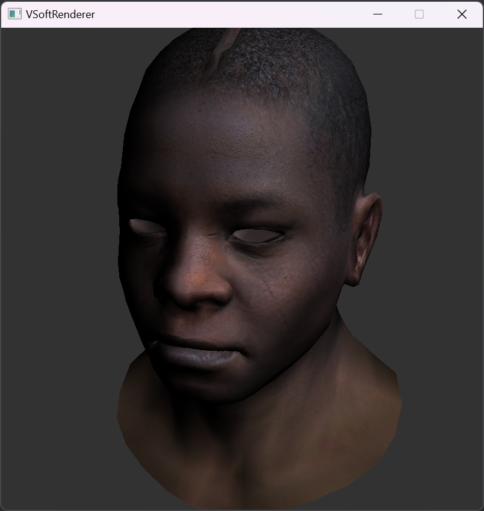

# VSoftRenderer

My toy soft renderer.

> VSoftRenderer is still under development...
> 
> Showcases:
> 
> - Gouraud Shading
>   
> - Gouraud Shading with Texture
>   

## Features

- Programmable Shading Pipeline

    - Define a shader through C++:
        ```c++
        struct GouraudShader : public VGLShaderBase
        {
            int TextureSlot;
            Vector3Float LightDirection;
        
            Matrix4 MVP;
        
            Vector3Float              VaryingIntensity; // written by vertex shader, read by fragment shader
            std::vector<Vector2Float> VaryingUVs {3};
        
            virtual Vector3Float vert(Vertex& vertex, int vertexIndexInFace) override
            {
                VaryingIntensity[vertexIndexInFace] = std::max(0.0f, LightDirection * vertex.Normal);
                VaryingUVs[vertexIndexInFace] = vertex.UV;
                Vector3Float glVertex = MVP * VGLShaderBase::vert(vertex, vertexIndexInFace);
                return glVertex;
            }
        
            virtual bool frag(Vector3Float bc, VSoftRenderer::Color& color) override
            {
                float intensity = VaryingIntensity * bc;
                Vector2Float uv = VaryingUVs[0] * bc.X + VaryingUVs[1] * bc.Y + VaryingUVs[2] * bc.Z;
                color = sample2D(TextureSlot, uv.X, uv.Y) * intensity;
                return false;
            }
        };
        ```
      
    - Use OpenGL-like APIs:
      ```c++
      // ... load mesh & texture from disk

      glViewPort(0, 0, 800, 800);
      
      glClearColor({50, 50, 50, 255});
      glClear();
      
      DirectionalLight light(Vector3Float(1, 1, 1).Normalized());

      // Camera parameters
      Vector3Float eye(1 , 1, 3);
      Vector3Float center(0 , 0, 0);
      Vector3Float up(0 , 1, 0);

      Matrix4 modelMatrix = Matrix4::Identity();
      Matrix4 viewMatrix = glLookAt(eye, center, up);
      Matrix4 projectionMatrix = glProjection(eye, center);

      Matrix4 mvp = projectionMatrix * viewMatrix * modelMatrix;

      glBindTexture(0, texture);

      GouraudShader shader = {};
      shader.MVP = mvp;
      shader.LightDirection = light.GetDirection();
      shader.TextureSlot = 0;

      glBindShader(0, &shader);

      for (int meshIndex = 0; meshIndex < meshes.size(); ++meshIndex)
      {
          glBindMesh(meshIndex, meshes[meshIndex]);
          glUseShaderProgram(0);
          glDrawMeshIndexed(meshIndex);
      }
      ```