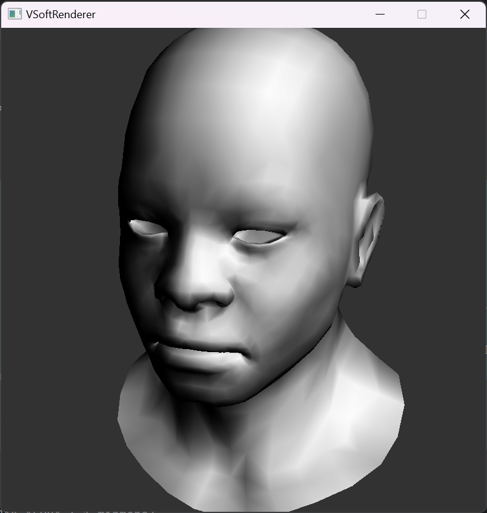
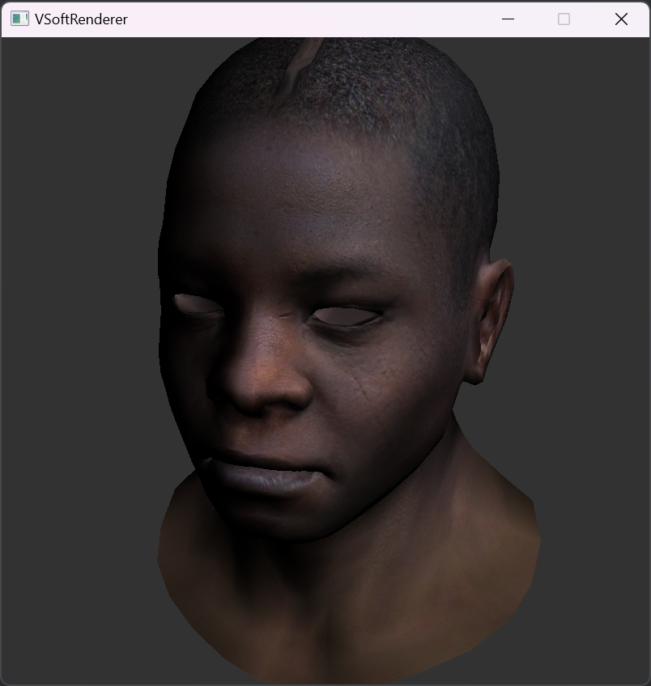

# VSoftRenderer

<h4 align="center">
  <strong>VSoftRenderer</strong> is my cross-platform 3D toy soft renderer.
</h4>


<p align="center">
    <a href="https://github.com/zzxzzk115/VSoftRenderer/actions" alt="CI-Windows">
        </a>
    <a href="https://github.com/zzxzzk115/VSoftRenderer/actions" alt="CI-Linux">
        </a>
    <a href="https://github.com/zzxzzk115/VSoftRenderer/actions" alt="CI-MacOS">
        </a>
    <a href="https://github.com/zzxzzk115/VSoftRenderer/issues" alt="GitHub Issues">
        
    </a>
    <a href="https://github.com/zzxzzk115/VSoftRenderer/blob/master/LICENSE" alt="GitHub">
        
    </a>
</p>

> VSoftRenderer is still under development...
> 
> Showcases:
> 
> - Gouraud Shading
>   
> - Gouraud Shading with Texture
>   

## Features

- Cross Platform (Windows, Linux, macOS)
- Light-weight Implementation
- Programmable Shading Pipeline

    - Define a shader through C++:
        ```c++
        struct GouraudShader : public VGLShaderBase
        {
            int BindTextureSlot;
        
            Vector3Float UniformLightDirection;
            Matrix4      UniformMVP;
        
            Vector3Float              VaryingIntensity;
            std::vector<Vector2Float> VaryingUVs {3};
        
            virtual void vert(Vertex& vertex, int vertexIndexInFace, Vector3Float& gl_Position) override
            {
                VaryingIntensity[vertexIndexInFace] = std::max(0.0f, UniformLightDirection * vertex.Normal);
                VaryingUVs[vertexIndexInFace] = vertex.UV;
                gl_Position = UniformMVP * vertex.Position;
            }
        
            virtual bool frag(Vector3Float bc, VGL::Color& gl_FragColor) override
            {
                float intensity = VaryingIntensity * bc;
                Vector2Float uv = VaryingUVs[0] * bc.X + VaryingUVs[1] * bc.Y + VaryingUVs[2] * bc.Z;
                gl_FragColor = sample2D(BindTextureSlot, uv.X, uv.Y) * intensity;
                return false;
            }
        };
        ```
      
    - Use OpenGL-like APIs:
      ```c++
      // ... load mesh & texture from disk

      glViewPort(0, 0, 800, 800);
      
      glClearColor({50, 50, 50, 255});
      glClear();
      
      DirectionalLight light(Vector3Float(1, 1, 1).Normalized());

      // Camera parameters
      Vector3Float eye(1 , 1, 3);
      Vector3Float center(0 , 0, 0);
      Vector3Float up(0 , 1, 0);

      Matrix4 modelMatrix = Matrix4::Identity();
      Matrix4 viewMatrix = glLookAt(eye, center, up);
      Matrix4 projectionMatrix = glProjection(eye, center);

      Matrix4 mvp = projectionMatrix * viewMatrix * modelMatrix;

      glBindTexture(0, texture);

      GouraudShader shader = {};
      shader.UniformMVP = mvp;
      shader.UniformLightDirection = light.GetDirection();
      shader.BindTextureSlot = 0;

      glBindShader(0, &shader);

      for (int meshIndex = 0; meshIndex < meshes.size(); ++meshIndex)
      {
          glBindMesh(meshIndex, meshes[meshIndex]);
          glUseShaderProgram(0);
          glDrawMeshIndexed(meshIndex);
      }
      ```

## Prerequisites

To build **VSoftRenderer**, you must first install the following tools.

### Windows 10/11

- Visual Studio 2019 (or above) with C++ Desktop Development Environment
- CMake 3.20 (or above)
- Git 2.1 (or above)

### Ubuntu 22.04 or above (Linux or WSL2)

Install prerequisite packages:

```bash
sudo apt-get update
sudo apt-get install build-essential cmake git clang libx11-dev libxrandr-dev libxrender-dev libglvnd-dev libxinerama-dev libxcursor-dev libxi-dev
```

### MacOS

- XCode 13 (or above)
- CMake 3.20 (or above)
- Git 2.1 (or above)

## Build VSoftRenderer

Clone this repository:

```bash
git clone --recursive git@github.com:zzxzzk115/VSoftRenderer.git
```

### Build on Windows

Build it automatically:

Just double-click `BuildWindows.bat ` or you can simply use Jetbrains CLion to debug or release.

Build it manually:

```bash
cmake -S . -B build
```

Then open the generated solution file with Visual Studio.

### Build on Linux / WSL2

Build it automatically:

```bash
chmod +x *.sh && ./BuildLinux.sh
```

### Build on MacOS

Build it automatically:

```bash
chmod +x *.sh && ./BuildMacOS.sh
```

Build it manually:

```bash
cmake -S . -B build -G "Xcode"
```

Then open the generated project file with XCode.
  
## Acknowledgement

We would like to thank the following projects for their invaluable contribution to our work:

- [tinyrenderer](https://github.com/ssloy/tinyrenderer)
- [raylib](https://github.com/raysan5/raylib)
- [tinyobjloader](https://github.com/tinyobjloader/tinyobjloader)

## License

This project is licensed under the [MIT](https://github.com/zzxzzk115/VSoftRenderer/blob/master/LICENSE) license.